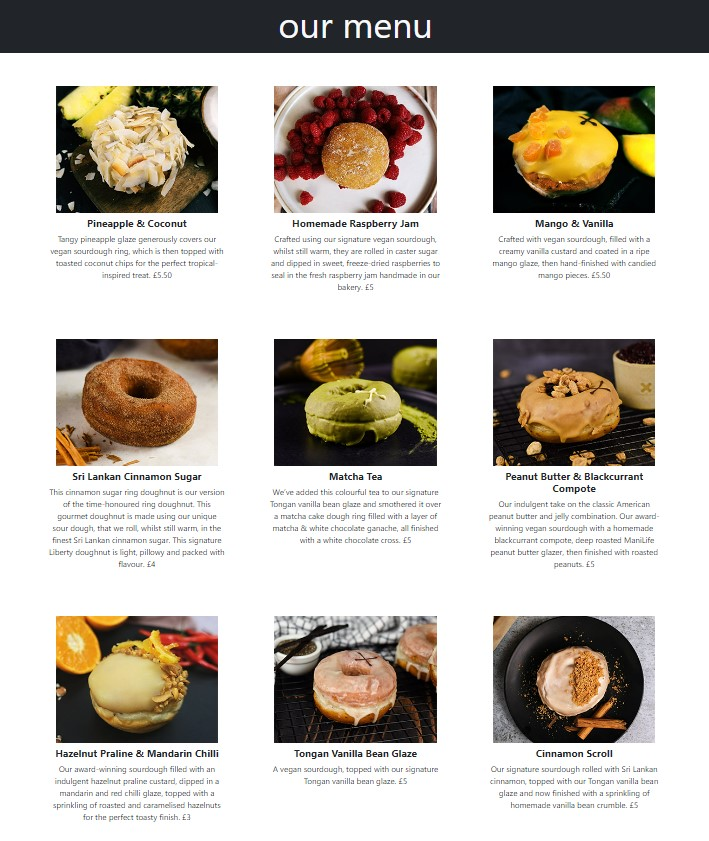
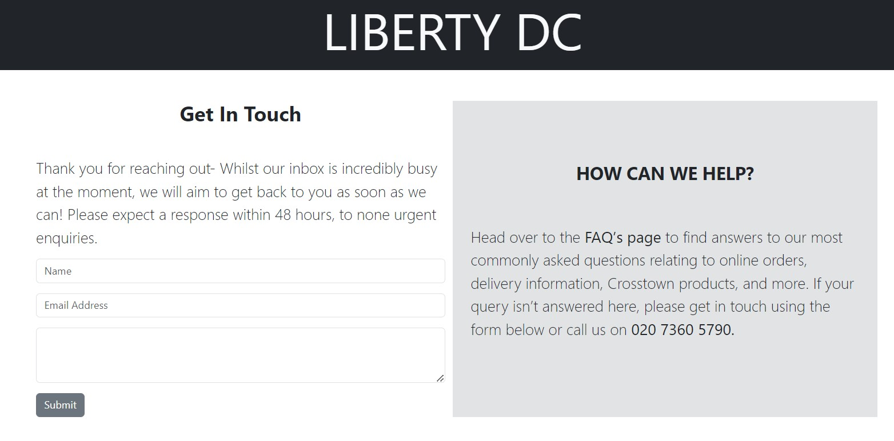

##         Web de Restaurante Responsive  

Este es el segundo proyecto de mi entrenamiento como full stack developer. En este proyecto nos han pedido realizar la carta de un restaurante utilizando Bootstrap con un diseño 100% responsive.  

### Proceso:
El proyecto lo he realizado utilizando Bootstrap5, HTML5 y CSS3. Me he inspirado en una pastelería de donuts artesanales. He realizado las 3 vistas requeridas, home, menú y contacto, todas vinculadas a través de HTML.
En Home a través de DOUGHNUTS en el encabezado se accede al menú y desde contact en el pie de página se accede al formulario.

### Página Home con encabezado

### Página Home con pie de página

### Página Home Mobile first

### Página Menú

### Página Menú Mobile first

### Página Formulario de contacto

### Página Contacto Mobile first

#### Link al repositorio
https://github.com/martaop18/project2LibertyCoffee.git

### Tecnologías utilizadas: 

